# Buy-Sell-Store — Project Flowcharts

Top-to-bottom views of the **Buy-Sell-Store** monorepo: system architecture, backend, frontend, user journeys, and data flow.

> **How to view:** Paste any `mermaid` block into [Mermaid Live Editor](https://mermaid.live) or open this file on GitHub / VS Code with a Mermaid preview extension.

---

## Table of contents

1. [System overview](#1-system-overview)
2. [Repository structure](#2-repository-structure)
3. [Runtime architecture](#3-runtime-architecture)
4. [Backend layers](#4-backend-layers)
5. [Backend request flow](#5-backend-request-flow)
6. [GraphQL API surface](#6-graphql-api-surface)
7. [Data model (conceptual)](#7-data-model-conceptual)
8. [Frontend bootstrap](#8-frontend-bootstrap)
9. [Frontend route map](#9-frontend-route-map)
10. [Authentication flow](#10-authentication-flow)
11. [Buyer shopping flow](#11-buyer-shopping-flow)
12. [Seller management flow](#12-seller-management-flow)
13. [Feature → implementation map](#13-feature--implementation-map)

---

## 1. System overview

High-level view of the two applications and external dependencies.

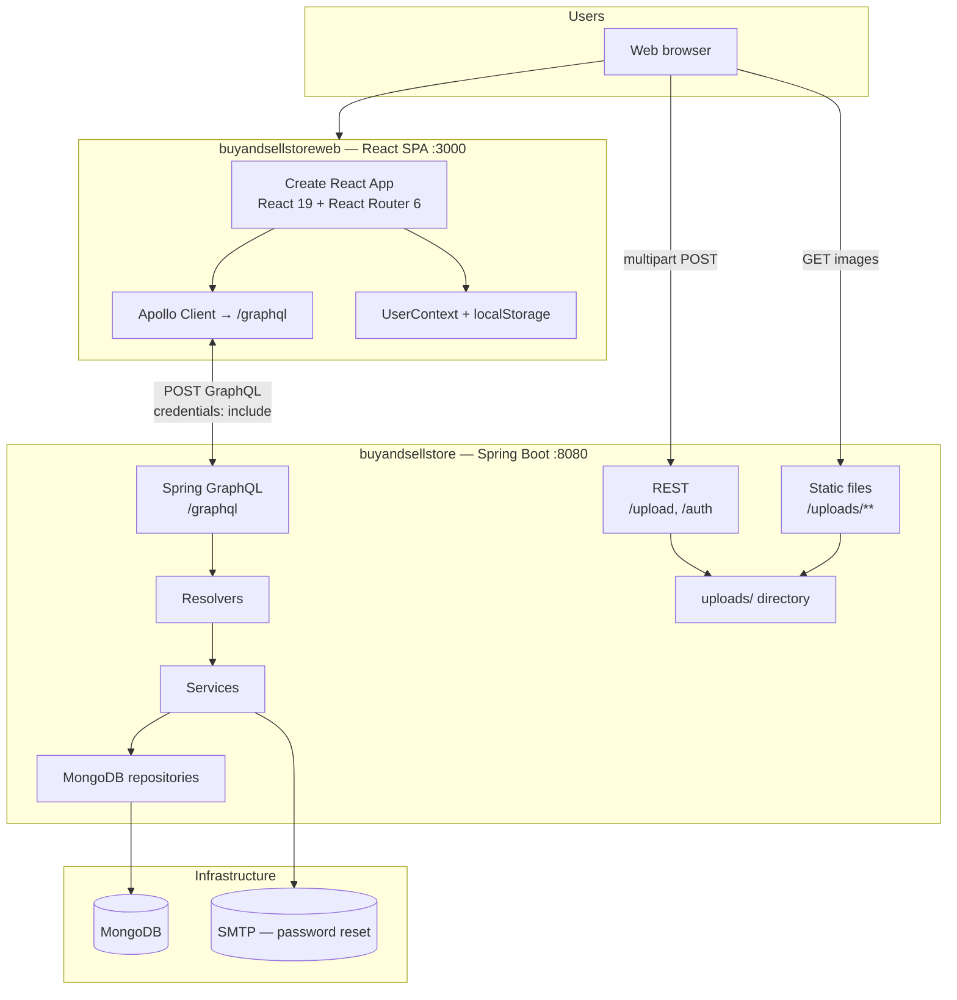

---

## 2. Repository structure

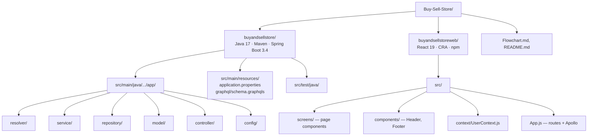

---

## 3. Runtime architecture

Ports, protocols, and integration points.

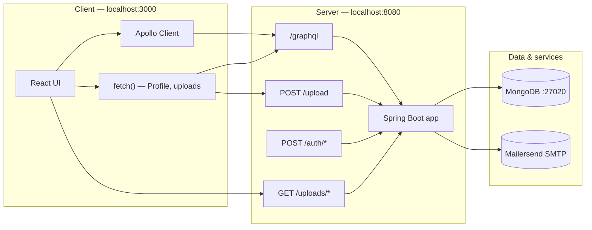

| Component | URL / path | Purpose |
|-----------|------------|---------|
| React dev server | `http://localhost:3000` | SPA |
| GraphQL API | `http://localhost:8080/graphql` | Primary API |
| GraphiQL | `http://localhost:8080/graphiql` | API explorer (dev) |
| File upload | `POST http://localhost:8080/upload` | Product / profile images |
| Static uploads | `GET http://localhost:8080/uploads/{file}` | Served files |
| MongoDB | `mongodb://...@localhost:27020/buyAndSellStore_prod` | Persistence |

---

## 4. Backend layers

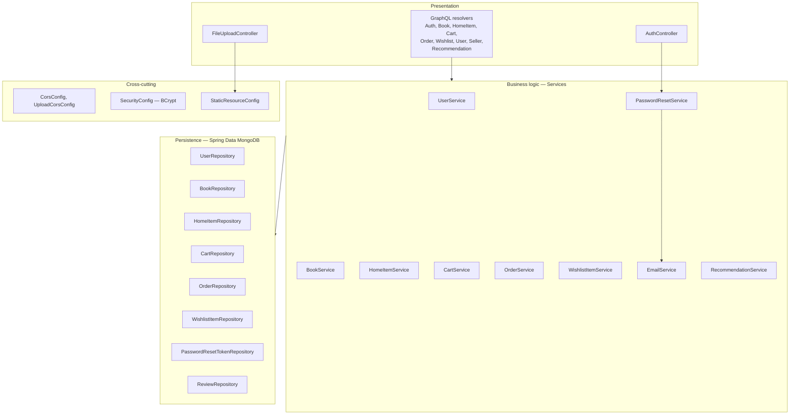

---

## 5. Backend request flow

Typical GraphQL request from UI to database.

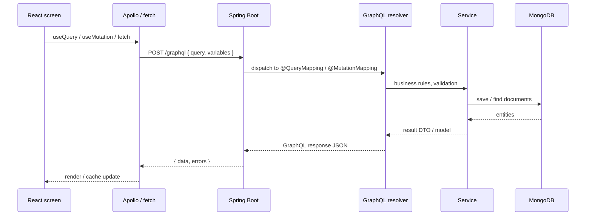

**Profile image upload (alternate path):**

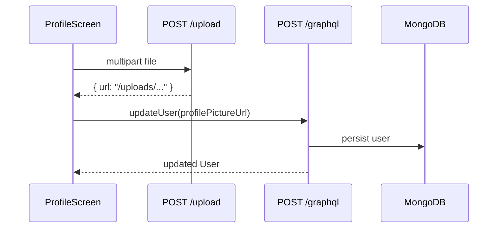

---

## 6. GraphQL API surface

Major operations grouped by domain (see `buyandsellstore/src/main/resources/graphql/schema.graphqls`).

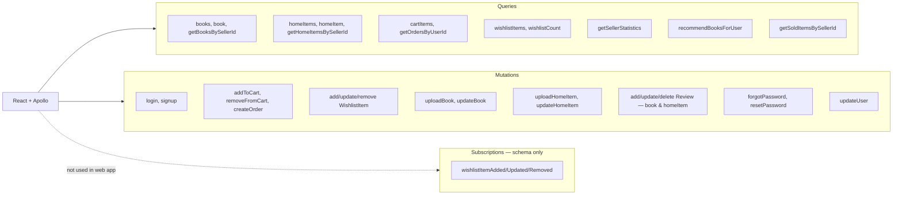

---

## 7. Data model (conceptual)

Core MongoDB documents and relationships (simplified).

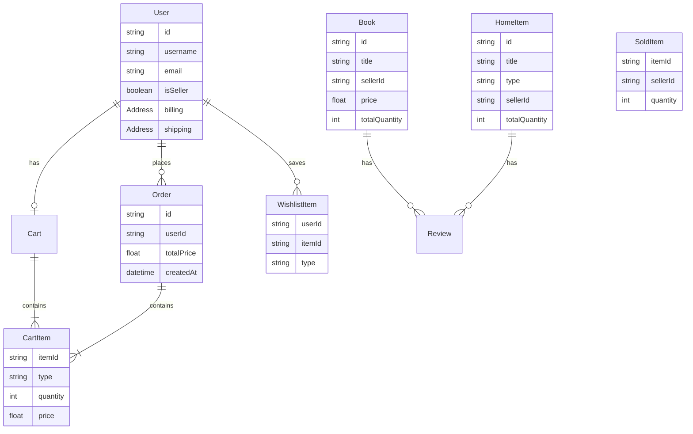

---

## 8. Frontend bootstrap

How the React app initializes on every page load.

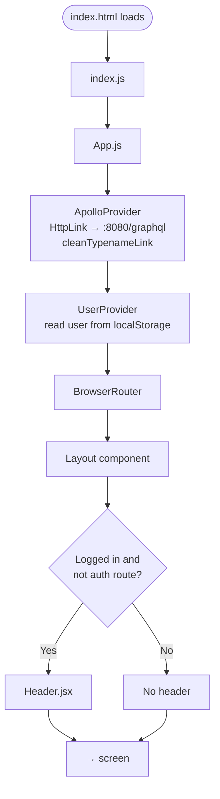

---

## 9. Frontend route map

All routes defined in `buyandsellstoreweb/src/App.js`.

```mermaid
flowchart TB
  subgraph public["Public routes"]
    login["/login"]
    signup["/signup"]
    forgot["/forgotpassword"]
    reset["/reset-password"]
    homeItem["/home-item/:id"]
    sellerDash["/seller-dashboard"]
    manageInv["/manageinventory"]
    upload["/uploadItems"]
    revenue["/revenue"]
  end

  subgraph protected["Protected — ProtectedRoute"]
    home["/home"]
    sellerHome["/sellerHome"]
    books["/books"]
    bookId["/book/:id"]
    homeitems["/homeitems"]
    cart["/cart"]
    wishlist["/wishlist"]
    checkout["/checkoutScreen"]
    profile["/profile"]
    sellerstats["/sellerstats"]
    inventory["/inventory"]
  end

  wildcard["* unknown path"] -->|Navigate| home

  Guard["ProtectedRoute:\nuser in UserContext?"]
  Guard -->|No| login
  Guard -->|Yes| protected
```

| Path | Screen | Protected? | Header when logged in? |
|------|--------|:------------:|:----------------------:|
| `/login` | LoginScreen | No | Hidden |
| `/signup` | SignUpScreen | No | Hidden |
| `/forgotpassword` | ForgotPasswordScreen | No | Hidden |
| `/reset-password` | ResetPasswordScreen | No | Hidden |
| `/home` | HomeScreen | Yes | Yes |
| `/books` | BooksScreen | Yes | Yes |
| `/book/:id` | BookDetailScreen | Yes | Yes |
| `/homeitems` | HomeItemsScreen | Yes | Yes |
| `/home-item/:id` | HomeItem | No | Yes |
| `/cart` | CartScreen | Yes | Yes |
| `/wishlist` | WishlistScreen | Yes | Yes |
| `/checkoutScreen` | CheckoutScreen | Yes | Yes |
| `/profile` | ProfileScreen | Yes | Yes |
| `/sellerHome` | SellerHome | Yes | Yes |
| `/sellerstats` | SellerStats | Yes | Yes |
| `/manageinventory` | ManageInventory | No | Yes |
| `/uploadItems` | UploadItems | No | Yes |
| `/inventory` | Inventory | Yes | Yes |
| `/revenue` | Revenue | No | Yes |
| `/seller-dashboard` | SellerDashboard | No | Yes |
| `*` | → `/home` | — | — |

---

## 10. Authentication flow

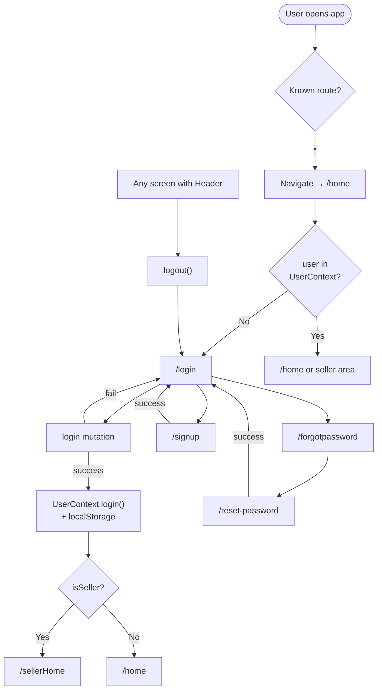

---

## 11. Buyer shopping flow

End-to-end path for a non-seller user.

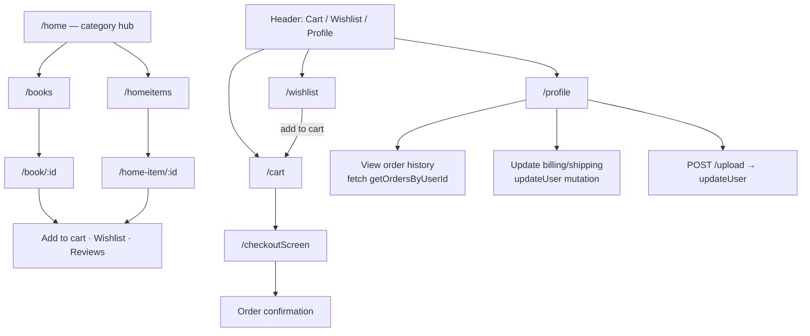

---

## 12. Seller management flow

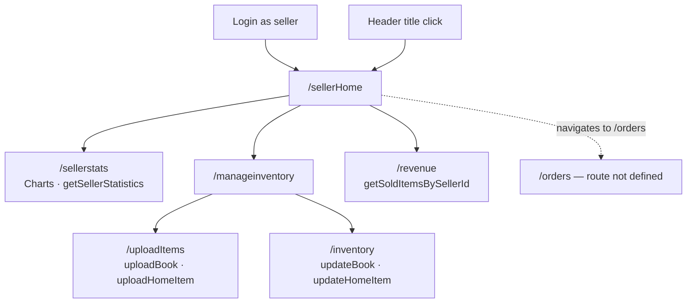

---

## 13. Feature → implementation map

Quick reference linking product features to code locations.

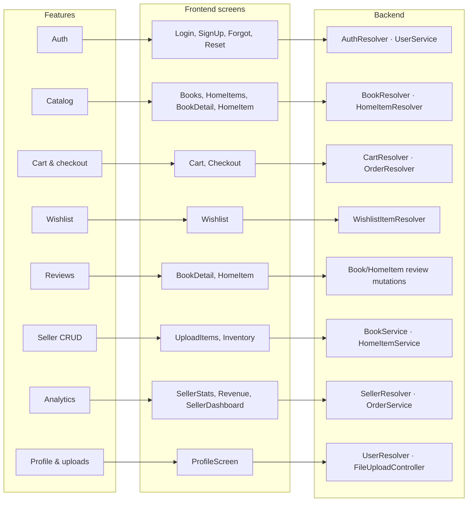

---

## Technology stack (reference)

| Layer | Technologies |
|-------|----------------|
| **Frontend** | React 19, Create React App, React Router 6, Apollo Client, styled-components, react-hook-form, Yup, Chart.js, react-toastify |
| **Backend** | Java 17, Spring Boot 3.4, Spring GraphQL, Spring Data MongoDB, Spring Web, Spring Mail, Spring Security Crypto |
| **Database** | MongoDB |
| **API** | GraphQL (+ REST for uploads and legacy auth endpoints) |

---

*Generated for the Buy-Sell-Store repository. Update this file when routes, resolvers, or architecture change.*
